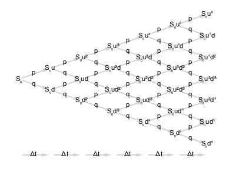

# Tutorial

## Motivating example

In the example code below we show, without detailed explanation, how to construct and value a European call option on a single stock using combinations of the basic primitive types.  Each of the primitive types and operations utilized will be explained in more detail in subsequent sections.

```@example motivating
using Miletus
using Base.Dates
using Miletus.TermStructure
using Miletus.DayCounts
using BusinessDays

import Miletus: When, Give, Receive, Pay, Buy, Both, At, Either, Zero
import Miletus: YieldModel, maturitydate
```
Acquire the rights to a contract with 100 units

```@example motivating
x = Receive(100)
```

Acquire the rights to a contract with 100 units as an obligation
```@example motivating
x = Pay(100)   
```

Acquire the rights to a contract with 100 USD as an obligation
```@example motivating
x = Pay(100USD)
```

Construct an object containing the core properties of our stock model including the start price, yield curve and carry curve
```@example motivating
s = SingleStock()
```

The functional definition for buying a stock at a given price
```@example motivating
x = Both(s, Pay(100USD))
```

Calling the Buy method defined as in the previous operation
```@example motivating
x = Buy(s, 100USD)
```

Defining the acquisition of rights to a contract on a given date
```@example motivating
x = When(At(Date("2016-12-25")), Receive(100USD))
```

Constructing a zero coupon bond with a function having the same components as in the previous operation
```@example motivating
z = ZCB(Date("2016-12-25"), 100USD)
```

One of the most basic of option structures, acquisition of either a stock or an empty contract having no rights and no obligations
```@example motivating
x = Either(SingleStock(), Zero())
```

Combining all of the above concepts into the definition of a European call option
```@example motivating
x = When(At(Date("2016-12-25")), Either(Buy(SingleStock(), 100USD), Zero()))
```

Calling the functional form of a European Call option defined using the same components as in the previous operation
```@example motivating
eucall = EuropeanCall(Date("2016-12-25"), SingleStock(), 100USD)
```

Construction of a Geometric Brownian Motion Model used for describing the price dynamics of a stock
```@example motivating
gbmm = GeomBMModel(Date("2016-01-01"), 100.0USD, 0.1, 0.05, .15)
```

Valuation of our European call option whose underlying stock model uses a Geometric Brownian Motion Model for its price dynamics
```@example motivating
value(gbmm, eucall)
```

## Building Contracts with Primitive and Derived Types

Most of the types defined in Miletus are built upon a small set abstract types (`Contract`, `Observable{T}`, `Process{T}`, `TermStruct`, `DayCount`, `AbstractModel`), and each of the primitive combinators described in the original PJ&E papers are implemented as a `typealias` of a set of Julia types having one of these abstract types as a super type.

### Contract primitives

The set of `Contract` primitives includes the following types:

* `Zero()`

    * A "null" contract
* `Amount(o::Observable)`

    * Receive an amount of the observable object `o`
* `Scale(s::Observable, c::Contract)`

    * Scale the contract `c` by `s`
* `Both(c1::Contract, c2::Contract)`

    * Acquire both contracts `c1` and `c2`
    * This type corresponds to the `and` combinator in the PJ&E papers.
* `Either(c1::Contract, c2::Contract)`

    * Acquire either contract `c1` or `c2`
    * This type corresponds to the `or` combinator in the PJ&E papers.
* `Give(c::Contract)`

    * Take the opposite side of contract `c`
    * Acquires the rights to contract `c` as an obligation
* `Cond(p::Observable{Bool}, c1::Contract, c2::Contract)`

    * If expression `p` is true at the point of acquisition, then acquire contract `c1`, otherwise acquire contract `c2`
* `When(p::Observable{Bool}, c::Contract)`

    * Acquire the contract `c` at the point when observable quantity `p` becomes `true`.
* `Anytime(p::Observable{Bool}, c::Contract)`

    * May acquire the contract `c` at any point when observable quantity `p` is `true`.
* `Until(p::Observable{Bool}, c::Contract)`

    * A contract that acts like contract `c` until `p` is `true`, at which point the object is abandoned, and hence becomes worthless.

### Primative Observables

Like `Contract`, `Observable{T}` is defined as an abstract type.  Specific instances of an `Observable` type are objects, possibly time-varying, and possibly unknown at contracting time, for which a direct measurement can be made.  Example observable quantities include date, price, temperature, population or other objects that can be objectively measured.

Built-in primitive `Observable` types include the following:

* `DateObs() <: Observable{Date}`

    * A singleton type representing the "free" date observable
* `AcquisitionDateObs() <: Observable{Date}`

    * The acquisition date of the contract
* `ConstObs{T} <: Observable{T}`

    * A constant observable quantity
    * `ConstObs(x)` - Constructor function for a constant observable of value `x`

### Derived Observables

Built-in derived observable types include the following:

* `AtObs(t::Date) <: Observable{Bool}`

    * `AtObs(t::Date) = LiftObs(==,DateObs(),ConstObs(t))`
    * An observable that is `true` when the date is `t`
    * This type of observable is used as part of the construction of the derived contract primitives `ZCB`, `WhenAt`, `Forward`, and `European`

* `BeforeObs(t::Date) <: Observable{Bool}`

    * `BeforeObs(t::Date) = LiftObs(<=,DateObs(),ConstObs(t))`
    * An observable that is `true` when the date is before or equal to `t`
    * This type of observable is useds as part of the construction of the derived contract primitives `AnytimeBefore` and `American`

Each of these derived `Observable` types makes use of a `LiftObs` operation.  

`LiftObs` is defined as an `immutable` type whose type constructor applies a function to one or more existing `Observable` quantities to produce a new `Observable`.

## Constructing Observables and Contracts

To provide an example of how one goes about using the above primitive and derived `Observable` types, let's return to one of the operations from the opening "Motivting Example" section.  We will break apart each piece of the constructed zero coupon bond, to point out the specific `Contract` and `Observable` components utilized.

Defining the acquisition of rights to a contract on a given date
```@example motivating
x = When(At(Date("2016-12-25")), Receive(100USD))
```

Constructing a zero coupon bond with a function having the same components as in the previous operation
```@example motivating
z = ZCB(Date("2016-12-25"), 100USD)
```

The most basic primitives in the above zero coupon bond construction are the `Amount` primitive `Contract` type used for representing the value of 100, the `CurrencyUnit` and `CurrencyQuantity` types used when representing USD, and the `DateObs` primitive `Observable` type used for representing the a `Date`.

The expression `Receive(100USD)` creates a `Contract` object that provides acquisition rights to 100USD.

The expression `At(Date("2016-12-25"))` creates a new `LiftObs` observable object that is `true` when the current date in the valuation model is "2016-12-25".  The implementation of the `At` observable type constructor includes the following operations:

```@example lift
using Miletus # hide
import Miletus: LiftObs, DateObs, ConstObs # hide

typealias AtObs LiftObs{typeof(==),Tuple{DateObs,ConstObs{Date}},Bool}

AtObs(t::Date) = LiftObs(==,DateObs(),ConstObs(t))

typealias At AtObs

nothing # hide
```

The arguments to `LiftObs` in the definition of `AtObs` include:

* The `==` function that will be applied to two observable values on date quantities
* A `DateObs` object that acts as a reference observable quantity for the "Current Date" when valuing a model
* An input date `t` which becomes a constant observable quantity `ConstObs(t)` to which the reference observable is compared when valuing a contract.

The commands below show both the hierarchy of observables and the type of the result returned by a call to `At`.

```@example motivating
At(Date("2016-12-25"))
```

```@example motivating
typeof(At(Date("2016-12-25")))
```

With use of the `When` primitive `Contract`, the combination of our defined `Receive(100USD)` `Contract` object with the above `At(Date("2016-12-25"))` `Observable` object constructs new a zero coupon bond `Contract` that defines a payment of 100USD to the holder on December 25th, 2016.

The concept of optionality provides a contract acquirer with a choice on whether to exercise particular rights embedded in that contract.  The most basic `Contract` primitives representing optionality in Miletus are the `Either` and `Cond` primitives described previously.

Adjusting the zero coupon bond example above to incorporate the `Either`, `Both` and `AtObs` `Contract` and `Observable` primitives allow for implementing a European Call option as repeated below.

```@example motivating
x = When(At(Date("2016-12-25")), Either(Both(SingleStock(), Pay(100USD)), Zero()))
```

The above operations are defined as the typealias EuropeanCall
```@example motivating
eucall = EuropeanCall(Date("2016-12-25"), SingleStock(), 100USD)
```

By combining various `Contract` and `Observable` primitives, contract payoffs of arbitrary complexity can be constructed easily.

The next section lists a number of built-in derived contracts that combine the above primitives in the defintion of various types of options instruments.

## Built-in Derived Contracts

By combining these contract primitives, a set of `typealias` quantities are defined that allow for more compact syntax when creating various derived contracts.  Using these type aliases, a set of constructors for these derived contracts are defined as shown below:

* `Receive(x::Union{Real,CurrencyQuantity}) = Amount(ConstObs(x))`

    * Receive an amount of a particular real valued object or currency

* `Pay(x::Union{Real,CurrencyQuantity}) = Give(Receive(x))`

    * Pay an amount of a particular real valued object or currency

* `Buy(c::Contract, x::Union{Real,CurrencyQuantity}) = Both(c, Pay(x))`

    * Purchase a contract `c` for an amount of a particular real valued object or currency

* `Sell(c::Contract, x::Union{Real,CurrencyQuantity}) = Both(Give(c), Receive(x))`

    * Sell a contract `c` for an amount of a particular real valued object or currency

* `ZCB(date::Date, x::Union{Real,CurrencyQuantity}) = When(AtObs(date), Receive(x))`

    * A "Zero Coupon Bond" that provides for obtaining a particular amount of a real valued object or currency on a particular maturity `date`

* `WhenAt(date::Date, c::Contract) = When(AtObs(date), c)`

    * Activate the contract `c` on the particular maturity `date`

* `Forward(date::Date, c::Contract, strike::Union{Real,CurrencyQuantity}) = WhenAt(date, Buy(c, strike))`

    * Purchase a contract `c` for a particular amount of a real valued object or currency (`strike`) on a particular maturity `date`

* `Option(c::Contract) = Either(c, Zero())`

    * Activate either contract `c` or nothing

* `European(date::Date, c::Contract) = WhenAt(date, Option(c))`

    * On a particular maturity `date` acquire either contract `c` or nothing

* `EuropeanCall(date::Date, c::Contract, strike::Union{Real,CurrencyQuantity}) = European(date, Buy(c, strike))`

    * A European call contract, with maturity `date`, on underlying contract `c` at price `strike`

* `EuropeanPut(date::Date, c::Contract, strike::Union{Real,CurrencyQuantity}) = European(date, Sell(c, strike))`

    * A European put contract, with maturity `date`, on underlying contract `c` at price `strike`

* `AnytimeBefore(date::Date, c::Contract) = Anytime(BeforeObs(date), c)`

    * Activate the contract `c` anytime before a particular maturity `date`

* `American(date::Date, c::Contract) = AnytimeBefore(date, Option(c))`

    * Either activate the contract `c` or nothing anytime before a particular maturity `date`

* `AmericanCall(date::Date, c::Contract, strike::Union{Real,CurrencyQuantity}) = American(date, Buy(c, strike))`

    * An American call contract, with maturity `date`, on underlying contract `c` at price `strike`

* `AmericanPut(date::Date, c::Contract, strike::Union{Real,CurrencyQuantity}) = American(date, Sell(c, strike))`

    * An American put contract, with maturity `date`, on underlying contract `c` at price `strike`

* `AsianFixedStrikeCall(dt::Date, c::Contract, period::Period, strike) = European(dt, Buy(MovingAveragePrice(c, period), strike))`

    * An Asian option contract where the strike price is constant and whose pay off is based on the moving average price of the underlying over the life of the contract.

* `AsianFloatingStrikeCall(dt::Date, c::Contract, period::Period, strike) = European(dt, Both(c, Give(MovingAveragePrice(c, period))))`

    * An Asian option contract where the strike price and payoff are based on the moving average price of the underlying over the life of the contract.

## DayCounts

Miletus provides implementations of a number of separate calendar implementations that take into consideration day count conventions from different countries and financial organizations worldwide.  Each day count type is an instance of an abstract `DayCount` type.

Specific `DayCount` instances present in Miletus include:

* [Actual360](https://en.wikipedia.org/wiki/Day_count_convention#Actual.2F360) - Uses a coupon factor equal to the number of days between two dates in a Julian calendar divided by 360.
* [Actual365](https://en.wikipedia.org/wiki/Day_count_convention#Actual.2F365_Fixed) - Uses a coupon factor equal to the number of days between two dates in a Julian calendar divided by 365.
* [BondThirty360 / USAThirty360](https://en.wikipedia.org/wiki/Day_count_convention#30.2F360_US) - Uses a coupon factor equal to the number of days between two dates assuming 30 days in any month and 360 days in a year.  Used for the pricing of US Corporate Bonds and many US agency bond issues.
* [EuroBondThirty360 / EuroThirty360](https://en.wikipedia.org/wiki/Day_count_convention#30E.2F360) - Uses a coupon factor equal to the number of days between two dates assuming 30 days in any month and 360 dates in a year.
* ItalianThirty360
* [ISMAActualActual](https://en.wikipedia.org/wiki/Day_count_convention#Actual.2FActual_ICMA)
* [ISDAActualActual](https://en.wikipedia.org/wiki/Day_count_convention#Actual.2FActual_ISDA)
* [AFBActualActual](https://en.wikipedia.org/wiki/Day_count_convention#Actual.2FActual_AFB)

For each `DayCount` type, the `yearfraction` function provides the fractional position within the associated year for a provided input date.

Modifying a particular date in the course of a calculation often needs to take into account the above `DayCount` convention, as well as a relevant holiday calendar.  The `adjust` function takes into account holidays through functionality used from the `HolidayCalendar` included `BusinessDays` package.

## Processes

In the context of the contract definition language implemented by Miletus, a `Process`, `p(t)`, is a mapping from time to a random variable of a particular type.  Both `Contract` objects and `Observable` objects can be modeled as a `Process`.  Like `Contract` and `Observable`, a `Process` is defined in Miletus as an abstract type, where subtypes of `Process` are implemented as immutable types.

The following `Process` types are available for operating on `Contract` and `Observable` objects

* `DateProcess()` - maps an `Observable` date to the given date.
* `ConstProcess(val::T)` - maps an `Observable` value to a constant value (`val::T`) for all times.
* `CondProcess(cond::Process{Bool}, a::Process{T}, b::Process{T})` - based on first `Process` boolean value, maps to one of two distinct `Process` values.

## Term Structures

Term Structures provide a framework for representing how interest rates for a given set of modeling assumptions change through time.

* TermStruct - An abstract type that is a super type to all Term Structures implmented in Miletus
* YieldTermStructure - An abstract type that encompasses various interest rate term structure models
* VolatilityTermStructure - An abstract type that encompasses various volatility term structure models
* ConstantYieldCurve - A concrete type encompassing a constant interest rate model
* ConstantVolatilityCurve - A concrete type encompassing a constant volatility model

* compound_factor - Multiplicative factor using the frequency and method by accumulated interest is included in principle for the purporses of interest rate calculations
* discount_factor - Inverse of the above compound_factor
* implied_rate - Determination of the current interest rate implied from the compounding factor
* forward_rate - A rate of interest as implied by the current zero rate of a given YieldTermStructure for periods of time in the future.
* zero_rate - The implied spot interest rate for a given YieldTermStructure and time horizon
* par_rate - A coupon rate for which a bond price equals its nominal value

# Models

A valuation model encompasses both the analytical mathematical description of the dynamics involved in how an observable quantity changes through time, as well as a numerical method used for discretizing and solving those analytical equations.

There are a wide variety of different analytical models for describing the value dynamics of interest rates, stocks, bonds, credit instruments (e.g. mortgages, credit cards, other loans) and other securities.  With regards to numerical methods, most techniques fall into one of four distinct categories; Analytical Methods (closed-form equations), Lattice Methods (e.g. trees), Monte Carlo Methods, and Partial Differential Equation solvers (e.g. finite difference, finite element).

The `Contract` and `Observable` primitives described previously are used for setting up payoffs that act as boundary conditions and final conditions on the use of a model to value an instrument.

## Implemented Models and Valuation methods

* Core Model (objective assumptions underlying the model. everything except volatility. objective parameters that can be observed in the market)

* Core Forward Model

* Yield Curves and Dates

* Geometric Brownian Motion

    * `GeomBMModel(startdate, startprice, interestrate, carryrate, volatility)`

       * A model for a `SingleStock`, following a geometric Brownian motion that includes the following fields:

         * `startdate`
         * `startprice`: initial price at `startdate`
         * `interestrate`: risk free rate of return.
         * `carryrate`: the carry rate, i.e. the net return for holding the asset:

           * for stocks this is typically positive (i.e. dividends)
           * for commodities this is typically negative (i.e. cost-of-carry)
        * `volatility`:

           * The `interestrate`, `carryrate` and `volatility` are all specified on a continously compounded, Actual/365 basis.
           * The price is assumed to follow the PDE:
          $dS_t = (\kappa - \sigma^2/2) S_t dt + \sigma S_t dW_t$
           * where $W_t$ is a Wiener process, and `κ = interestrate - carryrate`.
      * Associated valuation routines make use of analytical methods for solving the Black-Scholes equation, or when determining implied volatitilies based on the Black-Scholes equation.

* Binomial Geometric Random Walk

    * `BinomialGeomRWModel(startdate, enddate, nsteps, S₀, Δt, iR, logu, logd, p, q)`

       * A model for a Binomial Geometric Random Walk (aka Binomial tree)
       * The valuation routines for binomial trees are initialized using the payoff condition of the associated contract at expiry(`enddate`) and subsequently work backward in time through the tree to determine the value of the contract at the initial time (`startdate`).
      * Includes the following fields (or the `log` of those values)

         * `startdate` : start date of process
         * `enddate` : end date of process
         * `nsteps` : number of steps in the tree
         * `S₀` : inital value
         * `Δt` : the time-difference between steps, typically `days(startdate - enddate) / (365*nsteps)`
         * `iR` : discount rate, `exp(-Δt*interestrate)`
         * `u`  : scale factor for up
         * `d`  : scale factor for down
         * `p`  : up probability
         * `q`  : down probability, `1-p`

```@example binomialplots
using GraphPlot, LightGraphs, Colors, Compose, Gadfly # hide
function superscript(i::Int) # hide
      # "⁰=0x2070 ¹=0xb9 ²=0xb2 ³=0xb3 ⁴=0x2074 ⁵=0x2075 ⁶=0x2076 ⁷=0x2077 ⁸=0x2078 ⁹=0x2079 " # hide
      s = ""                       # hide
      if i == 0                    # hide
          return s                 # hide
      elseif i == 1                # hide
          return s                 # hide
      else                         # hide
          I = digits(i)            # hide
          for k = length(I):-1:1   # hide
              if I[k] == 0         # hide
                  s*="⁰"           # hide
              elseif I[k] == 1     # hide
                  s*="¹"           # hide
              elseif I[k] == 2     # hide
                  s*="²"           # hide
              elseif I[k] == 3     # hide
                  s*="³"           # hide
              elseif I[k] == 4     # hide
                  s*="⁴"           # hide
              elseif I[k] == 5     # hide
                  s*="⁵"           # hide
              elseif I[k] == 6     # hide
                  s*="⁶"           # hide
              elseif I[k] == 7     # hide
                  s*="⁷"           # hide
              elseif I[k] == 8     # hide
                  s*="⁸"           # hide
              elseif I[k] == 9     # hide
                  s*="⁹"           # hide
              end                  # hide
          end                      # hide
          return s                 # hide
      end                          # hide
end                              # hide

L = 7                            # hide
N = sum(1:L)                     # hide
M = sum(2*(1:L-1))               # hide
G = DiGraph(N+L)                 # hide
for l = 1:L-1                    # hide
      t1 = sum(1:l)                # hide
      t2 = sum(1:(l-1))            # hide
      for p = 1:l                  # hide
          m1 = t1 + p              # hide
          m2 = t1 + p + 1          # hide
          n  = t2 + p              # hide
          add_edge!(G,n,m1)        # hide
          add_edge!(G,n,m2)        # hide
      end                          # hide
end                              # hide

for l = 1:L-1                    # hide
      add_edge!(G,N+l,N+l+1)       # hide
end                              # hide

x = Float64[]                    # hide
y = Float64[]                    # hide
u = Int[]                        # hide
d = Int[]                        # hide
for l = 1:L                      # hide
      for p = 1:l                  # hide
          push!(x,l)               # hide
          push!(d,l-p)             # hide
          push!(u,p-1)             # hide
          yc = l - 1 - 2*(p-1)     # hide
          push!(y,yc)              # hide
      end                          # hide
end                              # hide

max_y = maximum(y)               # hide
min_x = minimum(x)               # hide
xc = min_x                       # hide
for l = 1:L                      # hide
      push!(y, max_y + 1)          # hide
      push!(x, xc)                 # hide
      push!(u,0)                   # hide
      push!(d,0)                   # hide
      xc += 1                      # hide
end                              # hide

u2 = max(u-d,0)                  # hide
d2 = max(d-u,0)                  # hide

U = String[]                     # hide
D = String[]                     # hide
U2 = String[]                    # hide
D2 = String[]                    # hide
nodelabels = String[]            # hide
nodelabels2 = String[]           # hide
for k = 1:length(u)-L            # hide
      if u[k] == 0                 # hide
          push!(U,"")              # hide
      elseif u[k] == 1             # hide
          push!(U,"u")             # hide
      else                         # hide
          push!(U,"u"*superscript(u[k])) # hide
      end                          # hide
      if d[k] == 0                 # hide
          push!(D,"")              # hide
      elseif d[k] == 1             # hide
          push!(D,"d")             # hide
      else                         # hide
          push!(D,"d"*superscript(d[k])) # hide
      end                          # hide
      push!(nodelabels,"S₀"*U[k]*D[k])   # hide

      if u2[k] == 0                # hide
          push!(U2,"")             # hide
      elseif u2[k] == 1            # hide
          push!(U2,"u")            # hide
      else                         # hide
          push!(U2,"u"*superscript(u2[k])) # hide
      end                          # hide
      if d2[k] == 0                # hide
          push!(D2,"")             # hide
      elseif d2[k] == 1            # hide
          push!(D2,"d")            # hide
      else                         # hide
          push!(D2,"d"*superscript(d2[k])) # hide
      end                          # hide
      push!(nodelabels2,"S₀"*U2[k]*D2[k]) # hide
end                              # hide

for l = 1:L                      # hide
      push!(nodelabels, "")        # hide
      push!(nodelabels2, "")       # hide
end                              # hide

edgelabels = fill("",G.ne)       # hide
for k = 1:M                      # hide
      edgelabels[k] = iseven(k) ? "p" : "q"  # hide
end                              # hide

for l = 1:L-1                    # hide
      edgelabels[M+l] = "Δt"       # hide
end                              # hide

l = L-1                          # hide
c = colorant"white"              # hide
nodesize = 2.0                   # hide

g = gplot(G,x,y,arrowlengthfrac=0.05, edgelabel = edgelabels, edgelabeldistx=-0.25, edgelabeldisty=-0.25, EDGELABELSIZE = 3.0, nodelabel = nodelabels, NODESIZE=0.04, NODELABELSIZE=1.5nodesize, nodefillc = c) # hide
draw(SVG("binomial_tree1.svg", 6inch, 4inch), g); nothing # hide
```

Plot of the underlying stock price dynamics on the binomial tree.



  * Cox-Ross-Rubenstein Model

    * Makes use of a risk-neutral valuation principle wherein the expected return from the traded security is the risk-free interest rate, and all future cash flows can be valued by discounting their respective cashflows at that risk-free interest rate.
    * Imposes the condition that d = 1/u
    * u = exp(σ*√Δt)
    * d = exp(-σ*√Δt)
    * p = (exp(r*Δt)-d)/(u-d)
    * q = (u-exp(r*Δt))/(u-d)

```@example binomialplots
g = gplot(G,x,y,arrowlengthfrac=0.05, edgelabel = edgelabels, edgelabeldistx=-0.25, edgelabeldisty=-0.25, EDGELABELSIZE = 3.0, nodelabel = nodelabels2, NODESIZE=0.04, NODELABELSIZE=1.5nodesize, nodefillc = c) # hide
draw(SVG("binomial_tree2.svg", 6inch, 4inch), g); nothing # hide
```

Plot of the underlying stock price dynamics on the binomial tree for the Cox-Ross-Rubenstein Model.   


  * Jarrow-Rudd Model

    * u = exp((r-σ^2/2)*Δt + σ*√Δt)
    * d = exp((r-σ^2/2)*Δt - σ*√Δt)
    * p = q = 0.5
    * NOTE: not risk-neutral

  * Jarrow-Rudd Risk Neutral

    * u = exp((r-σ^2/2)*Δt + σ*√Δt)
    * d = exp((r-σ^2/2)*Δt - σ*√Δt)
    * p = (exp(r*Δt)-d)/(u-d)
    * q = (u-exp(r*Δt))/(u-d)

  * Tian

    * u = 1/2*exp(r*Δt)*v*(v+1+sqrt(v^2+2v-3)), where v = exp(σ^2*Δt)
    * d = 1/2*exp(r*Δt)*v*(v+1-sqrt(v^2+2v-3)), where v = exp(σ^2*Δt)
    * p = (exp(r*Δt)-d)/(u-d)
    * q = (u-exp(r*Δt))/(u-d)

* Monte Carlo Model

    * montecarlo(m::GeomBMModel, dates, n)

       * Accepts a Geometrical Brownian Motion model of the underlying asset dynamics.
       * Samples `n` Monte Carlo paths of the model `m`, at time `dates`.
       * Returns a `MonteCarloModel`
    * MonteCarloModel(core, dates, paths)

        * A `MonteCarloModel` is a type that represents the result of a simulation of a series of asset prices and includes the following fields:
        * `core`: a reference `CoreModel`
        * `dates`: an `AbstractVector{Date}`
        * `paths`: a matrix of the scenario paths: the rows are the scenarios, and the columns are the values at each date in `dates`.
    * MonteCarloScenario(core, dates, path)

        * A `MonteCarloScenario` is a single simulation scenario of a `MonteCarloModel` and includes the following fields:
        * `core`: a reference `CoreModel`
        * `dates`: an `AbstractVector{Date}`
        * `paths`: an `AbstractVector` of the values at each date in `dates`.

## Functions available for operating on a Model

* `value()`
* `valueAt()`
* `forwardprice()`
* `yearfraction()`
* `yearfractionto()`
* `numeraire()`
* `startdate()`
* `ivol()`

## Implied Volatlity calculations
* SplineInterpolation

     * This is used to model interpolation between any two discrete points on a discrete convex curve. This implements double quadratic interpolation.
      * `x`: An Array of the discrete values on the x axis
      * `y`: An Array of the discrete values on the y axis
      * `weights`: An Array of tuples of the weights of every quadratic curve modelled between two discrete points on the curve
* SplineVolatilityModel

    * `ivol(m::SplineInterpolation, c::European)`

       * Compute the implied Black-Scholes volatility of an option `c` under the SplineVolatilityModel `m`.
    * `fit(SplineVolatilityModel, mcore::CoreModel, contracts, prices)`

       * Fit a `SplineVolatilityModel` using from a collection of contracts (`contracts`) and their respective prices (`prices`), under the assumptions of `mcore`.
    * `fit_ivol(SplineVolatilityModel, mcore::CoreModel, contracts, ivols)`

       * Fit a `SplineVolatilityModel` using from a collection of contracts (`contracts`) and their respective implied volatilities (`ivols`), under the assumptions of `mcore`.
* GeomBMModel

    * `ivol(m::CoreModel, c::Contract, price)`

       * Compute the Black-Scholes implied volatility of contract `c` at `price`, under the assumptions of model `m` (ignoring the volatility value of `m`).
    * `fitvol(GeomBMModel, m::CoreModel, c::Contract, price)`

       * Fit a `GeomBMModel` using the implied volatility of `c` at `price`, using the parametersof the `CoreModel` `m`.
* SABRModel

     * `ivol(m::SABRModel, c::European)`

       * Compute the implied Black-Scholes volatility of an option `c` under the SABR model `m`.
     * `fit_ivol(SABRModel, mcore::CoreModel, contracts, ivols)`

       * Fit a `SABRModel` using from a collection of contracts (`contracts`) and their respective implied volatilities (`ivols`), under the assumptions of `mcore`.
     * `sabr_alpha(F, t, σATM, β, ν, ρ)` - Not currently exported

       * Compute the α parameter (initial volatility) for the SABR model from the Black-Scholes at-the-money volatility.
         *  `F`: Forward price
         *  `t`: time to maturity
         *  `σATM`: Black-Scholes at-the-money volatility
         * `β`, `ν`, `ρ`: parameters from SABR model.

# Greeks

Miletus allows for generic derivatives of contract prices with respect to different metrics (otherwise known as greeks)

Consider the following contract:

```@example greeks
using Miletus, Base.Dates
d1 = today()                                                                
d2 = d1 + Day(150)                                                          
c = EuropeanCall(d2, SingleStock(), 56.5USD)                               
```

Now let us set up a model according to which we want the contract valued

```@example greeks
core = CoreModel(d1, 47.32USD, 0.0, 0.0)                                   
gbm = GeomBMModel(core, 0.1)                                              
```

Calculate `delta` greek:

```@example greeks
delta(gbm, c)
```

Other functions available:

* `vega`
* `rho`
* `gamma`

Miletus also allows you to calculate generic nth derivatives with respect to
various metrics. The following expression evaluates the third derivative of
the contract value with respect to volatility:

```@example greeks
greek(gbm, c; metric = :vol, n = 3)
```
